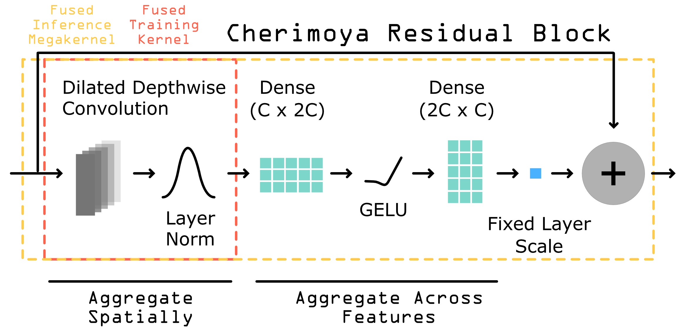

Architecture
============

Cherimoya is a compact convolutional architecture for predicting genomic
profile data from DNA sequence. It pairs a ConvNeXt-style backbone with
custom Triton GPU kernels and a training recipe designed for stability
on noisy high-throughput genomics signals.

This page describes the model, the Cheri Block, the three forward
paths, the loss design, and the training strategy. For measured
runtimes see :doc:`benchmarks`.

Model overview
--------------

.. image:: ../imgs/cheri-model.png
   :align: center
   :alt: Cherimoya model architecture

|

The model consists of three stages.

1. **Input stem**. A 1D convolution (``kernel_size=21``, padding 10)
   maps the one-hot encoded DNA sequence (4 channels) into
   ``n_filters`` channels, followed by a GELU non-linearity. Default
   ``n_filters`` is 128.

2. **Cheri-block backbone**. A stack of ``n_layers`` (default 9) Cheri
   Blocks with exponentially increasing dilation rates ``1, 2, 4, …,
   2^(n_layers-1)``. The blocks operate in channels-last layout
   ``(N, L, C)`` and are the heart of the model.

3. **Output heads**. A 75-bp convolution (``kernel_size=75``, padding
   37, i.e. length-preserving) produces the profile prediction over the
   trimmed output window — one channel per signal channel
   (``sum(signal_groups)`` total). The 75-bp kernel gives the profile
   head a local receptive field, letting it smooth and aggregate
   backbone features rather than projecting each position independently. A linear layer over the
   mean-pooled backbone features (also restricted to the trimmed output
   window) produces the count prediction — one prediction per signal
   *group* (``len(signal_groups)`` total). A stranded ``(+, -)`` pair is
   one group, so its two strands share a single count target.

The default 9-layer, 128-filter model has roughly 610K parameters. The
default input window is 2114 bp and the default output window is 1000
bp; the difference (557 bp on each side) is the ``trimming`` and equals
``46 + sum(2**i for i in range(n_layers))`` by default. The ``46`` is
the receptive field of the 21-bp input stem (10 bp each side) and the
75-bp profile head (37 bp each side);
the dilated-conv sum (``1 + 2 + 4 + … + 256 = 511`` for the default
9-layer model) is the receptive field of the backbone itself. The
trimming therefore matches the model's receptive field on each side,
so every output position has full context.

The Cheri Block
---------------

|

Each Cheri Block performs the following operations on an input of shape
``(N, L, C)``:

1. **3-tap dilated depthwise convolution**. Reads from positions
   ``(i - dilation, i, i + dilation)`` for each output position ``i``,
   with zero padding outside the sequence. One scalar weight per channel
   per tap, so the convolution has ``3 * C`` parameters.

2. **Per-example layer normalization**. Mean and variance are computed
   across the full ``(L, C)`` plane for each example (i.e. one
   normalization statistic pair per example, computed in fp32). The
   conv and norm are fused into a single Triton kernel; see
   :doc:`api/cheri`.

3. **Expansion projection**. A linear layer mapping ``C →
   expansion * C`` with no bias. ``expansion`` defaults to 2.

4. **GELU**. The ``tanh``-approximate variant.

5. **Contraction projection**. A linear layer mapping
   ``expansion * C → C`` with no bias.

6. **Residual connection with fixed scale**. The MLP output is scaled
   by a fixed constant ``residual_scale`` (default 0.15) and added
   back to the input. The small constant keeps the residual path
   near-identity at initialization, which stabilizes training of deep
   stacks.

In code:

.. code-block:: python

   def forward(self, X):
       X_conv = fused_dilated_conv_norm(X, self.conv_weight, self.dilation)
       X_mlp = self.linear2(self.activation(self.linear1(X_conv)))
       return X + X_mlp * self.residual_scale

The conv weight has shape ``(3, C)``; the linear weights have shapes
``(expansion * C, C)`` and ``(C, expansion * C)``. None of the layers in
a Cheri Block has a bias term.

Parameter initialization
------------------------

Every weight in the model — the input stem convolution, every Cheri
Block's depthwise conv and two linear projections, the 75-bp profile
head, and the count-head linear layer — is initialized with
``trunc_normal_(std=0.02)``. The biases that exist (input stem, profile
head, count head) are zero-initialized. The Cheri Block layers
themselves have no biases. The Kendall-Gal loss-weight tensors
``lw0`` and ``lw1`` are both shape ``(len(signal_groups),)`` — one
uncertainty weight per signal group on each side of the profile /
counts split — and are initialized to ones.

This small fixed init combined with the fixed ``residual_scale=0.15``
on each Cheri Block keeps the per-block contribution to the residual
stream small at step 0, so the loss landscape near initialization is
close to the identity-prediction landscape rather than a noisy
high-variance one.

Three forward paths
-------------------

The Cheri Block has three forward implementations that produce
numerically equivalent output, dispatched automatically per-call:

* **CPU fallback** on CPU input (pure PyTorch, differentiable,
  reference for the test suite).
* **Training Triton kernel** on CUDA with gradients enabled
  (``FusedDilatedConvNormFunc`` fuses conv + norm; the MLP runs as
  standard PyTorch ops).
* **Inference megakernel** on CUDA when ``torch.is_grad_enabled() ==
  False`` and ``expansion * n_filters % 16 == 0`` (fuses
  conv + norm + MLP + residual; bf16 dot products in the MLP).

All three agree on the model output to ~1e-5 max-abs at unit-scale
outputs, so existing trained checkpoints are bit-compatible across
paths. For the kernel-level implementation, the autotune config
space, and the inference-megakernel weight-cache details, see
:doc:`api/cheri`.

Customizing the backbone
------------------------

The :class:`~cherimoya.Cherimoya` model is a thin shell around a
``torch.nn.ModuleList`` of :class:`~cherimoya.CheriBlock` instances.
To swap the block for a different module, subclass and replace the
``self.blocks`` list in ``__init__``:

.. code-block:: python

   class MyVariant(Cherimoya):
       def __init__(self, *args, **kwargs):
           super().__init__(*args, **kwargs)
           self.blocks = torch.nn.ModuleList([
               MyBlock(self.n_filters, 2 ** i)
               for i in range(self.n_layers)
           ])

The forward pass calls each block as ``X = self.blocks[i](X)`` with
``X`` in channels-last layout ``(N, L, C)``. The block must accept
and return the same shape. The rest of the model (input stem, profile
head, count head, EMA, three-way optimizer routing) is unchanged.

The Muon routing rule is shape-based but name-aware: a parameter goes
to Muon iff ``ndim == 2 and "weight" in name and name != "linear.weight"
and "conv_weight" not in name``. The name-based exclusions peel off
the count head and the per-block ``conv_weight`` (the latter lives on
the depth-wise dilated path, not a projection matmul, so AdamW handles
it). Separately, ``lw0`` and ``lw1`` are routed to SGD by exact name
match. Any 2D projection weight inside a custom block will go to Muon
automatically. Override this in your own training script if you want
different routing.

Loss design
-----------

Cherimoya uses a two-component loss, both terms pooled per signal
group so every modality contributes equally regardless of channel
count:

* **Profile loss**: Per-channel multinomial negative log-likelihood
  (MNLL) along the length axis, then averaged across the channels of
  each signal group. A stranded ``(+, -)`` pair contributes one
  profile-loss term (the mean of its two strands' MNLLs); an
  unstranded track contributes one term directly.

* **Counts loss**: ``log1pMSE`` between predicted log counts and
  ``log(1 + total_counts)``, computed per signal *group*. A stranded
  ``(+, -)`` pair contributes a single per-group count target equal
  to the sum of both strands' counts.

These are combined using **Kendall-Gal uncertainty weighting** with
two learnable weight tensors both shape ``(len(signal_groups),)``:
``lw0`` weights the per-group profile loss and ``lw1`` weights the
per-group count loss. For single-task models (``signal_groups=[1]``)
both collapse to shape ``(1,)``.

.. code-block:: python

   w0 = 1.0 / (2.0 * self.lw0 ** 2)            # shape (len(signal_groups),)
   w1 = 1.0 / (2.0 * self.lw1 ** 2)            # shape (len(signal_groups),)
   loss = (w0 * profile_loss).sum() + (w1 * count_loss).sum()
   if self.lw0.requires_grad:
       loss += (torch.log(self.lw0) ** 2).sum()
       loss += (torch.log(self.lw1) ** 2).sum()

The log-squared regularizer prevents either weight from running to
zero. Once the per-element gradient becomes negligible
(``|grad(lw0)|.mean() < 1`` at the end of an epoch — averaging keeps
the threshold independent of the number of tracks), both tensors are
frozen for the rest of training.

Training strategy
-----------------

**Dual optimizer.** Parameters are routed between two optimizers based
on shape and naming:

* **Muon** receives every 2D parameter whose name contains
  ``"weight"`` and is *not* ``"linear.weight"`` (the count-head linear
  layer). In practice this is the two dense layers inside each Cheri
  Block.
* **AdamW** receives everything else: the input/output convolutions,
  the depthwise conv weight inside each Cheri Block, the count head's
  linear layer, the bias terms, and the loss-weight tensors
  (``lw0``, ``lw1``).

Default learning rates and weight decays:

.. list-table::
   :header-rows: 1
   :widths: 20 20 20

   * - Optimizer
     - Learning rate
     - Weight decay
   * - Muon
     - 0.025
     - 0.03
   * - AdamW
     - 0.001
     - 0.0
   * - SGD (lw)
     - 0.001
     - 0.0

**Schedule.** Muon and AdamW use a ``LinearLR`` warmup of
``n_warmup_epochs`` epochs (starting from 1% of the target LR)
followed by a ``CosineAnnealingLR`` decay over the remaining
``max_epochs - n_warmup_epochs`` epochs down to ``1e-5``, chained
with ``SequentialLR``. The SGD optimizer over ``lw0`` / ``lw1`` uses
the same warmup but then holds at a constant rate for the rest of
training rather than decaying.

**EMA at evaluation.** During training the model maintains an
:class:`~cherimoya.cherimoya.EMA` shadow of every floating-point
parameter with decay 0.999. After each optimizer step the EMA is
updated. At validation the shadow weights are swapped into the model
(``apply_shadow``), validation runs, and the original weights are
restored (``restore``). The model file saved as ``best`` and the
``.final.torch`` checkpoint contain the EMA-applied weights.

**Best-model selection.** The best checkpoint is the one with the
highest validation count Pearson correlation. ``early_stopping``, if
set, stops training when that count Pearson has not improved for that
many consecutive epochs.

**Reproducibility.** The peak/negative sampler
(:class:`~cherimoya.io.PeakNegativeSampler`) is a pure function of
``(random_state, epoch, idx)``. Two runs with the same ``random_state``
draw the same examples in the same order, and ``num_workers > 1`` is a
pure speed optimization — it does not change the batch sequence.

How these choices were made
---------------------------

Both the architecture (block layout, dilation schedule, expansion
factor, residual scale, normalization placement) and the training
recipe (optimizer split, learning rates, weight decays, warmup
length, EMA decay) were arrived at via large-scale, agent-driven
exploration of the design space rather than hand tuning. The
numbers reported on this page are the converged settings; they are
not arbitrary defaults but the result of automated search across
many candidate configurations.

Stability-first defaults
------------------------

A handful of choices keep deep stacks well-behaved during training:

* **Fixed residual scale** at initialization (``0.15``) keeps the
  residual path near-identity, so the loss landscape at step 0 is
  close to the input distribution.
* **No biases** inside Cheri Blocks (conv, ``linear1``, ``linear2``).
  Bias is only used in the input/output convolutions and the count
  head.
* **Low weight decay** on Muon-routed weights at the level of the
  optimizer's effective update (Muon uses orthogonalization, which is
  scale-invariant; ``muon_wd=0.03`` is a small safety margin).
* **Linear warmup** from 1% of the target LR over ``n_warmup_epochs``
  epochs (default 2) before cosine decay.
* **fp32 norm statistics** in the layer-norm step, even when the rest
  of the forward runs in bf16.
